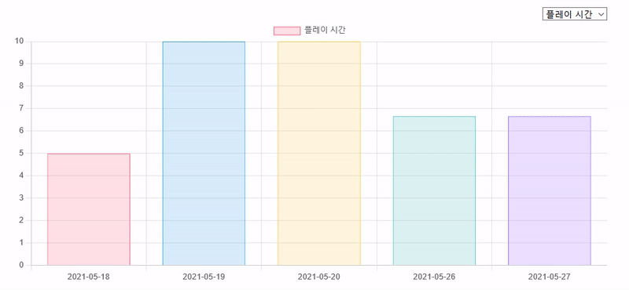

# World of Warcraft Tracker

<p align='center'>
    
    
    
    
    
    
</p>
<p align='center'>
    
</p>

### :timer_clock: 개발기간
+ 2021년 05월 ~ 현재

### 🛠️ 기술 선택 이유
+ React
    + 어떤 이벤트가 발생할때 페이지가 Refresh가 안되서 좀 더 부드러운 사용자 경험을 제공하고 싶어 해당 SPA 라이브러리를 선택했습니다.
    + 웹 페이지를 재사용 가능한 컴포넌트 단위로 쪼개 개발하는 점이 좋았습니다. 
    + 하지만 Virtual DOM 기반으로 동작한다는 이유가 가장 큽니다. 
+ TypeScript
    + Type Safe으로 인하여 컴파일 전 자바스크립트에서 발견하지 못한 에러들을 잡아준다는 장점이 있어서 선택하였습니다. 
    + 여태 자바스크립트로 개발을 해왔는데, 런타임 에러가 생각보다 많이 나서 컴파일 언어의 장점을 도입하고 싶어서 해당 토이 프로젝트는 타입스크립트도 진행하고 있습니다.
+ Context API
    + 별로의 라이브러리 설치가 필요없고 그만큼 가볍습니다.
    + 정말 전역으로 사용하는 사용자 정보만 상태로 관리하고 있습니다.
+ Styled-Components
    + 재사용 가능한 컴포넌트를 만든다는 점이 큰 장점이라 SCSS보다는 해당 라이브러리를 선택하였습니다.
+ Chart JS
    + d3 라이브러리보다 자유성이 떨어지는건 확실하나 단순 숫자의 현황만 보여주는 지금에서 d3를 사용한다는것은 오버 엔지니어링이라 판단해서 쉽게 사용할 수 있는 Chart JS를 선택했습니다.

###	:pushpin: 기능
+ 플레이 시간 시각화


+ 로그인/깃허브 로그인/회원가입/비밀번호 찾기
+ 인증 Custom Hook 개발
```Javascript
import React from 'react';
import firebase from 'firebase/app';
import { auth, Provider } from 'shared/firebase';
import logging from 'shared/logging';

const AuthContext = React.createContext<any | null>(null);

export function useAuth() {
    return React.useContext(AuthContext);
}

export default function AuthProvider({ children } : { children : React.ReactNode }) {

    const [currentUser, setCurrentUser] = React.useState<firebase.User | null>(null);
    const [loading, setLoading] = React.useState<boolean>(false);

    function register(email : string, password : string) {
        return auth.createUserWithEmailAndPassword(email, password); // Promise 객체 반환
    }

    function login(email : string, password : string) {
        return auth.signInWithEmailAndPassword(email, password); // Promise 객체 반환
    }

    function logout() {
        return auth.signOut();
    }

    function resetPassword(email : string) {
        return auth.sendPasswordResetEmail(email);
    }

    function githubLogin() {
        return auth.signInWithPopup(Provider.github); // Promise 객체 반환
    }

    React.useEffect(() => {
        const unsubscribe = auth.onAuthStateChanged(user => {
            setCurrentUser(user);
            setLoading(false);
        });

        return unsubscribe;
    }, []);

    const value = {
        currentUser,
        register,
        login,
        logout,
        resetPassword,
        githubLogin
    }

    return (
        <AuthContext.Provider value={ value }>
            { !loading && children }
        </AuthContext.Provider>
    );
};
```